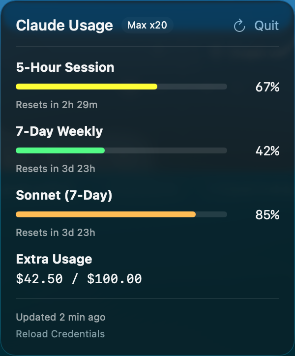

# Claude Usage

A macOS menu bar app that shows your Claude Pro/Max subscription usage at a glance.

If you use Claude Code heavily, you've probably hit rate limits without warning. Claude Usage sits in your menu bar and polls the Claude API every two minutes, showing your current 5-hour utilization as a simple percentage. Click it to see the full breakdown: 5-hour rolling, 7-day weekly, per-model Sonnet/Opus limits, and extra usage credits if you have them enabled. The bars change color as you approach your limits (green, yellow, orange, red) so you can tell at a glance whether it's a good time to kick off that big refactor.

   



## How it works

The app reads your Claude Code OAuth credentials from the macOS keychain (read-only, it never writes to the keychain) and uses them to hit the same usage API that Claude Code itself uses. It handles token refresh automatically, retries with exponential backoff on transient failures, and detects sleep/wake so it doesn't spam errors when your laptop wakes up without a network connection.

The menu bar label gives you a quick read:

| Label | Meaning |
|-------|---------|
| `37%` | Normal usage |
| `85%!` | Getting close (80%+) |
| `95%!!` | Almost at the limit (90%+) |
| `--%` | Waiting for data |
| `!!` | Something's wrong |

## Install

Grab the latest `ClaudeUsage-v*.zip` from [Releases](https://github.com/VerilyPete/tokens/releases). It's signed with a Developer ID certificate and notarized by Apple, so it should just work. Unzip it, drag `ClaudeUsage.app` wherever you like, and double-click.

You need Claude Code installed and logged in. That's it. The app piggybacks on the OAuth credentials that `claude login` stores in your keychain.

## First launch

When the app first accesses the keychain, macOS will show a dialog asking about keychain access. Click **"Always Allow"** (not just "Allow") so it doesn't ask every time.

If you're building from source with ad-hoc signing, macOS will also block the app on first launch. On Sonoma, run `xattr -cr ClaudeUsage.app`. On Sequoia, go to System Settings > Privacy & Security and click "Open Anyway." Release builds from GitHub are notarized and skip this step.

## Launch at Login

There's a "Launch at Login" checkbox right in the popover. Toggle it on and ClaudeUsage will start automatically when you log in. It uses the system `SMAppService` API, so you can also see and manage it in System Settings > General > Login Items.

## Building from source

No Xcode project files, no external dependencies. Just clone and build:

```bash
git clone https://github.com/VerilyPete/tokens.git
cd tokens
./build.sh
```

This compiles a release build with Swift Package Manager, packages it into a proper `.app` bundle, and ad-hoc codesigns it. The output is `ClaudeUsage.app` in the project root. You'll need macOS 14+ and Swift 6.0+ (Xcode 16+).

For development, `swift build` gives you a quick debug build and `swift run` runs it directly. The Info.plist is embedded via linker flags so everything works without the `.app` wrapper.

## Running the tests

```bash
swift test                           # all 132 tests
swift test --filter FormattingTests  # one suite
swift test --filter testFetchSuccess # one test
```

The full suite runs in under a second. All testable logic lives in a library target (`ClaudeUsageKit`) with protocol-based DI, so tests never touch the network or keychain.

## Architecture

The codebase is about 1,400 lines of Swift split into three targets.

**ClaudeUsageKit** is the library where all the logic lives. Models, keychain reading, API calls, polling, token refresh, formatting. Everything here is testable in isolation through two protocols (`KeychainReading` and `NetworkSession`). Swift 6 structured concurrency throughout, no Timer or Combine.

**ClaudeUsage** is a thin SwiftUI shell. The `@main` entry point with a `MenuBarExtra`, a `ContentView` popover with usage bars, error states, and the login toggle, and a reusable `UsageBarView`.

**ClaudeUsageTests** has 132 tests using Swift Testing (`@Suite`, `@Test`). Mocks use FIFO queues for deterministic response sequencing, including a `HoldingNetworkSession` that suspends at the network boundary for testing concurrent fetch guards.

## CI/CD

GitHub Actions on `macos-15` with Xcode 16.4. Every push to main runs build, test, and a full Developer ID signing and notarization pass. Creating a GitHub Release with a `v#.#.#` tag triggers the release job, which stamps the version into Info.plist, builds, signs, notarizes, and uploads the zip with a SHA-256 checksum to the release page. Artifacts are permanent, not the 30-day expiring kind.

## How it was built

This project was built almost entirely by Claude Code in web or iOS-based sessions with a human holding the steering wheel (and occasionally pumping the brakes). I cheated and swapped over to Claude Code CLI to knock out signing & notarization. The `plans/` directory tells the story:

**PLAN.md** is the original implementation plan. It started with research into [claude-monitor](https://github.com/rjwalters/claude-monitor) (an existing Python tool for the same purpose) to learn the API endpoints, keychain structure, and edge cases, then designed a clean-room Swift implementation from scratch. The plan went through four rounds of review and revision before any code was written.

**TDD_PLAN.md** restructured the implementation into strict red/green/refactor cycles. All testable logic was extracted into a library target with protocol-based DI so the test suite runs without touching the network or keychain.

**CI_PLAN.md** added GitHub Actions CI and folded in four bug fixes that came out of a Qodo code review.

**SIGNING_PLAN.md** designed the Developer ID signing and notarization pipeline.

**RELEASE_PLAN.md** added the release workflow and Launch at Login feature.

55 commits from initial plan to signed, notarized, CI-tested, auto-releasing app. Several of those were real-world bug fixes discovered by actually using the app against the live API: the API returning null where we expected a date, usage buckets being entirely absent for new accounts, extra usage amounts in cents rather than dollars, that sort of thing.

## Debugging

The app logs to the unified logging system under `com.tokens.claude-usage`:

```bash
log stream --predicate 'subsystem == "com.tokens.claude-usage"'
```

## License

MIT. See [LICENSE](LICENSE) for details.
